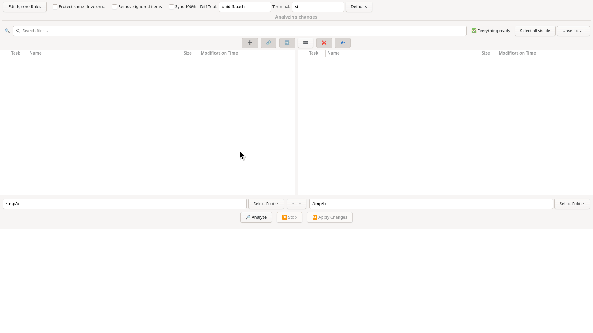

# cecup
GUI backup tool inspired by FreeFileSync and Rsync

## Logic
This tool is made to facilitate the correct and intuitive backup of a file
system. A correct backup must be, in general, a 1 to 1 copy from the source.
Everything must be preserved: Directory structure, file data and metatada
and links (both symbolic and hard).

This program, therefore, facilitates this processes by creating two lists
of files: one of all the files in the source, and other of all the files in the
destination. This way, the user can intuitively perform the backup, by first
previewing and confirming:
- which files are missing on the backup and will 
- which files are newer on the source
- which files are on the backup, but (no longer) exist on the source
- which files have different size
- which files are meant to be ignored
- which files are links to other files

FreeFileSync does have a similar interface, while also supporting 2 way backup,
which cecup doesn't.  However it does not support hard links. Rsync does support
everything imaginable, but it has no GUI for this use case, while also being too
overwhelming for the average user.

## Features
- Choose if you want a (potentially dangerous) perfect copy:
  this not only copies the new files and updates, but also:
  * Deletes files of the backup that are missing on the source
  * Overwrites files on the destination that are newer than on the source
    + If a destination file is newer than its source twin, then probably it was
      copied using a program that does not copy modification time metadata.
      However, if you used your backup device elsewhere it might well be that it
      has new content that you don't want to loose. So be careful.
- Choose if you want to delete ignored files on the destination.
- Hovering over a filename on the preview
  shows why the task was chosen for the file
- Right clicking a file opens a menu with the actions:
  * Open file
  * Open folder of the file
  * Copy full path
  * Copy relative path (relative to the source/backup path)
  * Apply action only for the file
  * Diff (compare source and backup versions of the file)
    + you must choose an external diff tool and terminal
  * Rename
  * Delete
  * Ignore. This opens a submenu with 4 ways to ignore a file
    + by extension (if any)
    + by its folder
    + by its complete path (matches only this file)
    + by its name (matches any file with the same basename)
